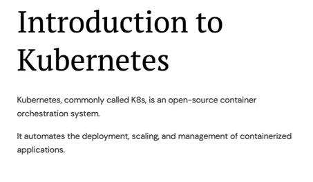
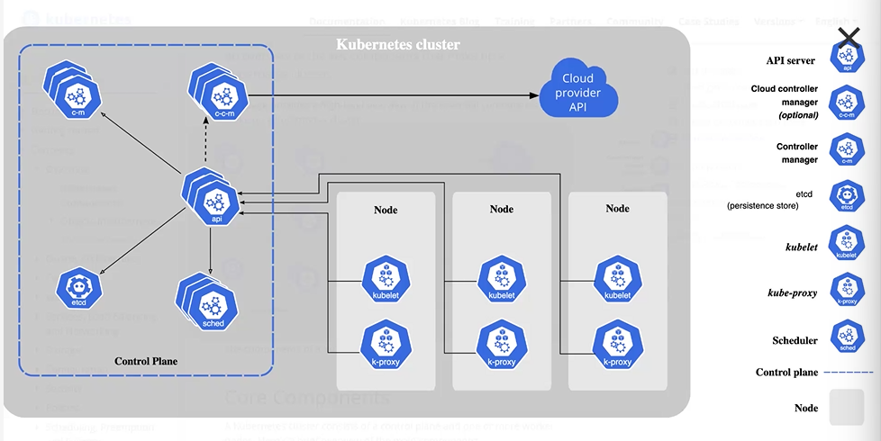
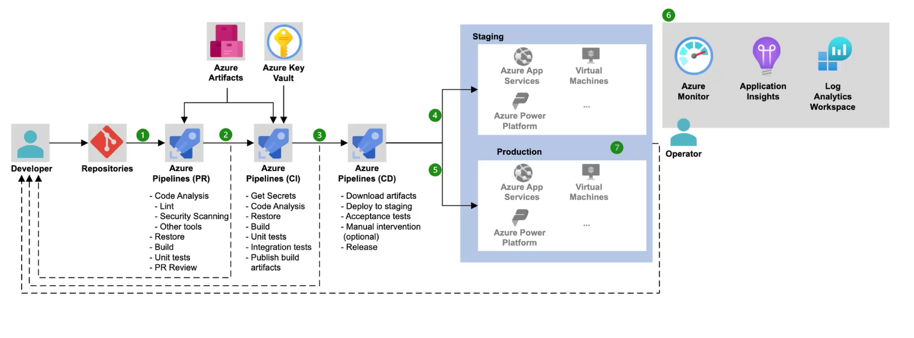

- sprint -> 10 days (2 weeks)

## Repository

- 
- 
- Branch policy -> tells who can access which branch
- one project can have multiple repositories

## Kubernetes

- 
- 
- pods = logical units => summation of pods -> cluster
- 
- Master Node : It manages all the Worker nodes
- Worker Node : Contains Pods[is equals to container]
- Cluster made up of : Master node + Many Worker nodes
- Clusters → Master Node → Worker Nodes → Pods[ multiple containers]
- 
- `https://kubernetes.io/` -> official kubernetes website
- `https://learn.microsoft.com/en-us/azure/aks/tutorial-kubernetes-deploy-cluster?tabs=azure-cli`
- 
- 
- Commands
  - `az group create --name myapp-rg --location eastus` -> create a resource group
  - `az acr create --resource-group myapp-rg --name akhilacontainerregistry --sku Basic` -> create a container
- 
- 
- 
- network policies -> rules and regulations that control the communication between pods
- 
- 
- Design the architecture of any ecommerce application starting from development to deployment.
  - 
