## Architecture of kubernetes

- 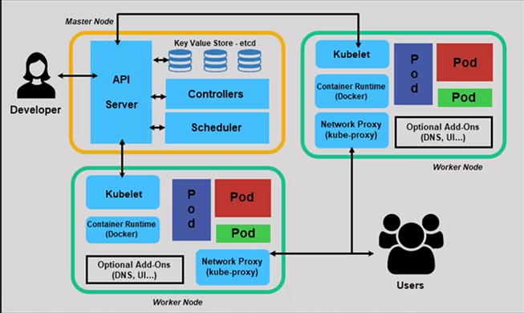
- 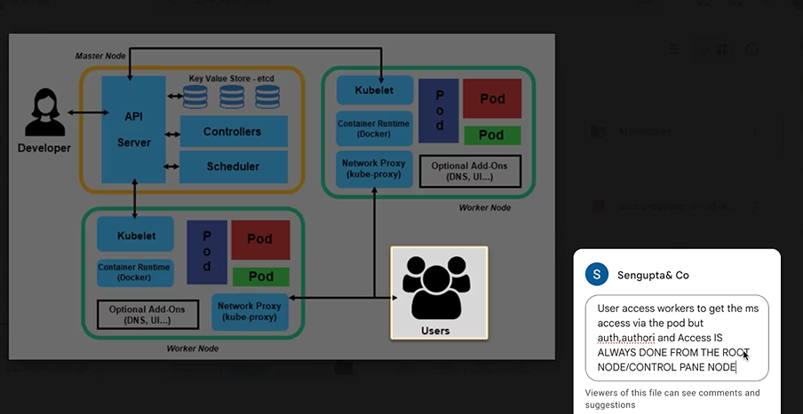
- 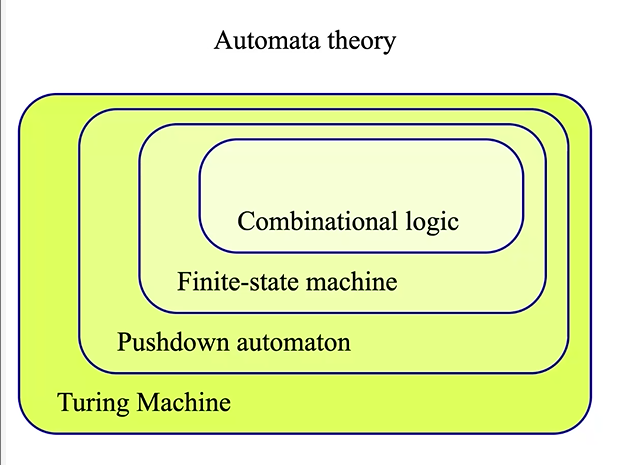
- 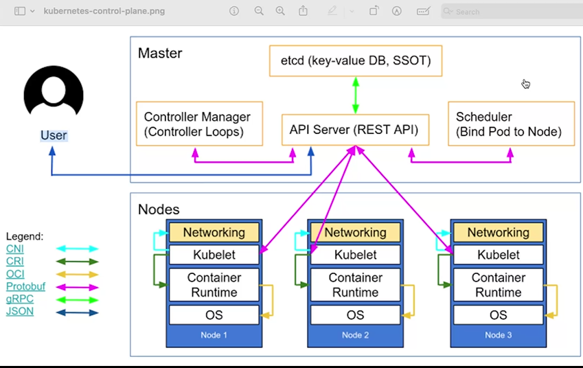
- 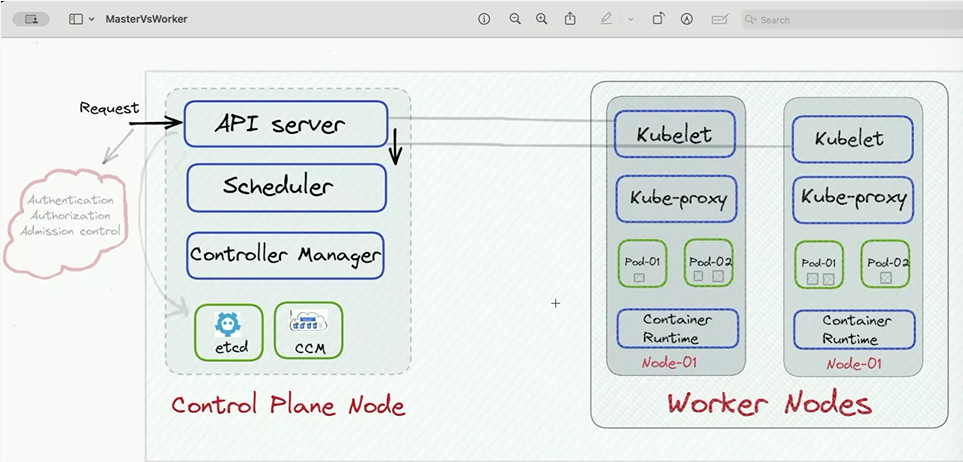
- etcd: A distributed key-value store that holds the configuration data and state of the cluster.
- 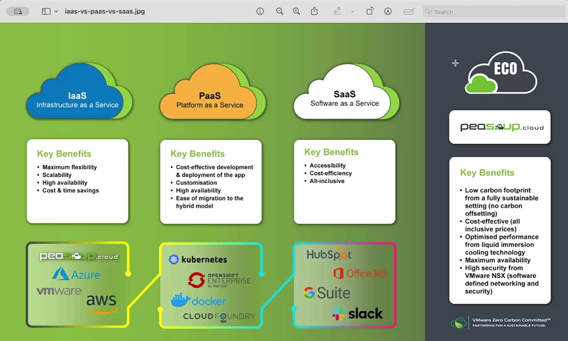
- 
- 
- Replica set -> combination of nodes which are dependent on each other can be deployed as a single node
- 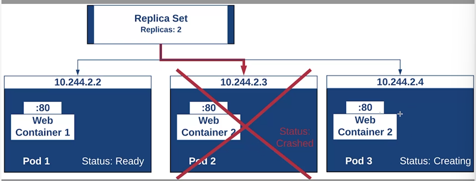
- if a particular pod fails / crashes it creates another

## Namespace

- 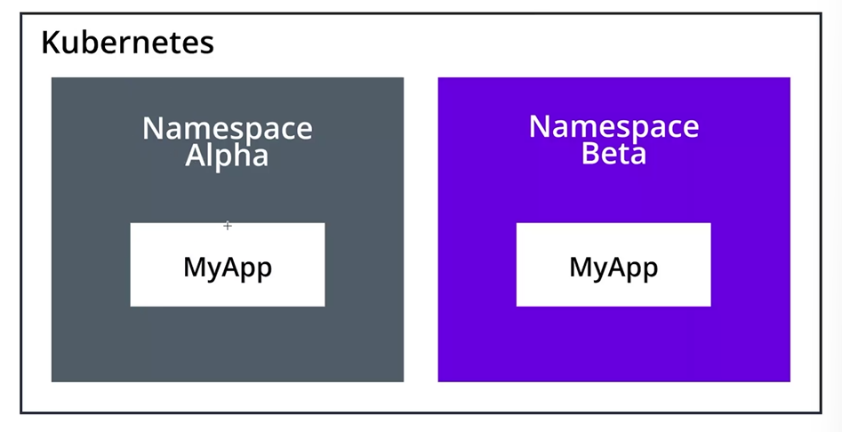
- namespace -> address given to a application
- 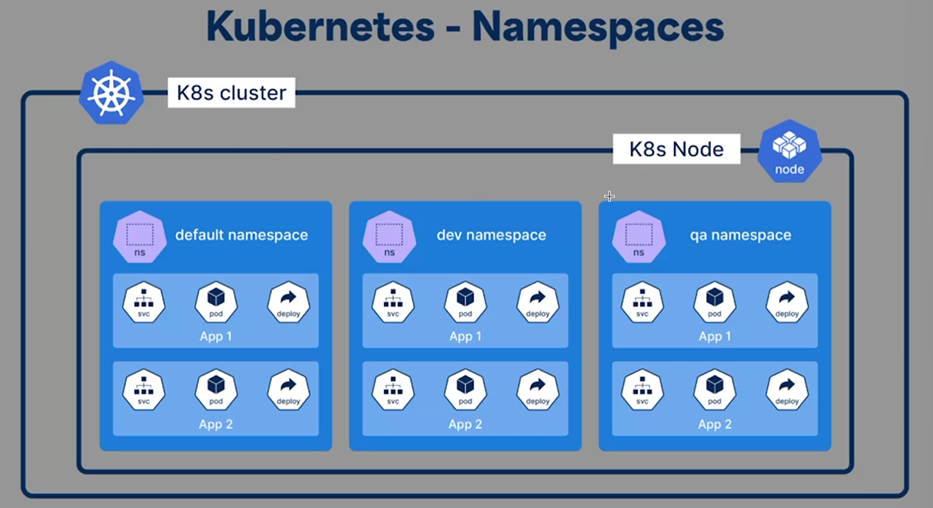
- 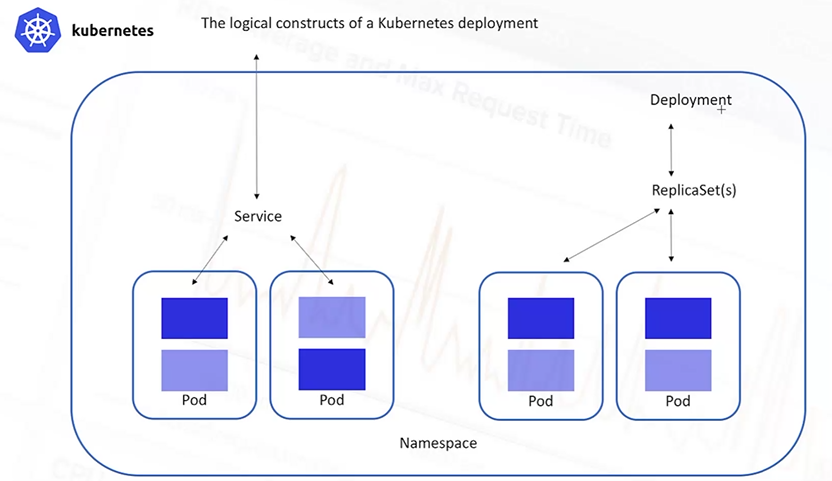
- 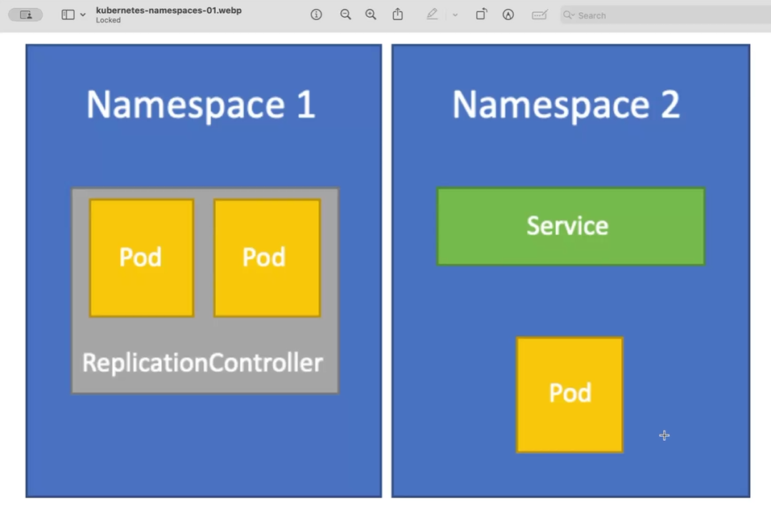
- 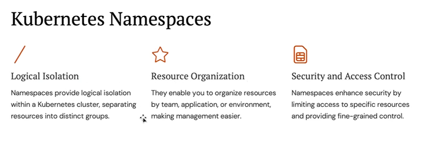

## DaemonSet vs ReplicaSet

- 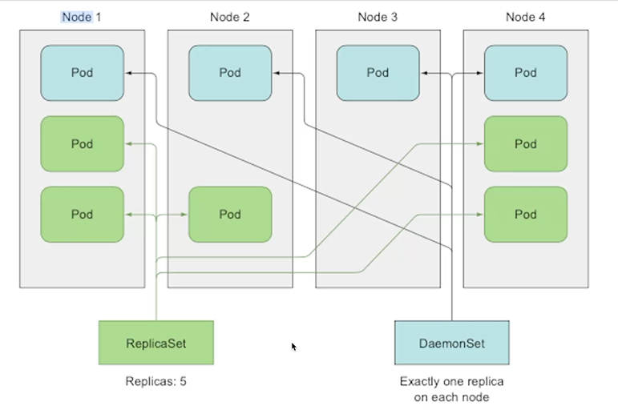
- 
- `kubectl` -> kubernetes control command

## Controller Manager

- 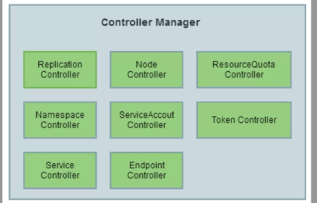

## Aks-production-deployment Architecture

- 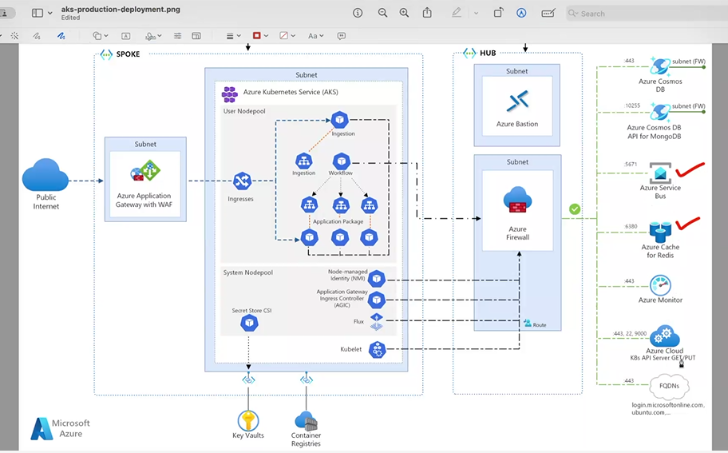
- ingresses -> internally processing of a service
- 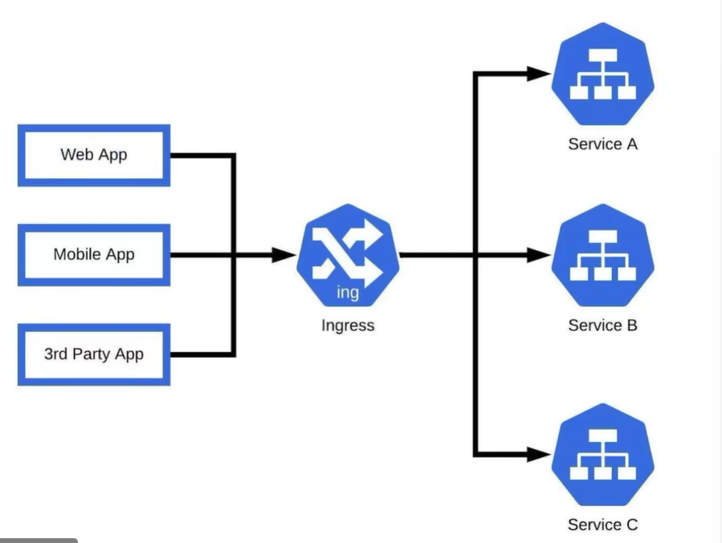
