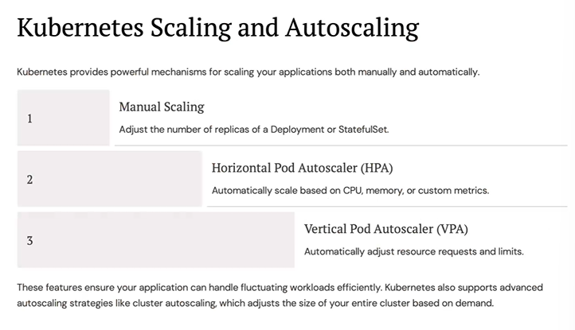

- 

## Kubernetes Architecture

- 
- 

## Ingress controller

- 
- ingestion ->
- 
- 

## Azure devops

- 
- epic : high level task
- Epics and features -> created by project managers and managers
- stories and tasks -> developers
- 
- `https://learn.microsoft.com/en-us/azure/devops/boards/backlogs/define-features-epics?view=azure-devops&tabs=agile-process`

## Kubernetes scaling and autoscaling

- 

## Kubernetes Rollbacks

- 
- Question : Describe the Process and Considerations for Designing a High-Availability Kubernetes Cluster.
- Answer : In designing a high-availability cluster for an e-commerce platform, we deployed a multi-master setup across three availability zones, with etcd members distributed similarly to ensure data redundancy. A TCP load balancer was configured to distribute API requests to the API servers, ensuring no single point of failure. We also implemented node auto-repair with Kubernetes Engine to automatically replace unhealthy nodes.

## Kubernetes Monitoring and Logging

- 
- 
