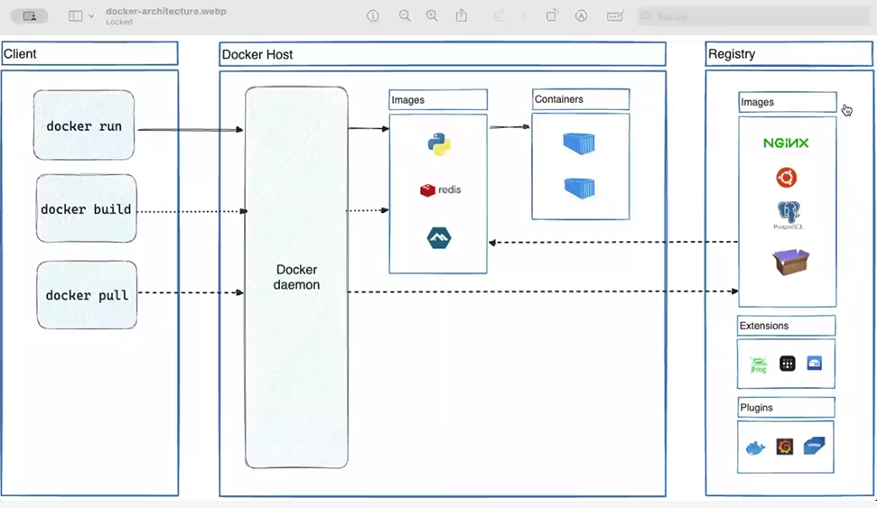

## Docker

- 
- 
- 
- 
- here type-2 is most preferabble , because if some failure occurs at hypervisor , there are some risks in type 1 ,where as in type 2 the host os will be in running state only .
- cost wise also type 2 is most preferabble
- 
- 
- container -> its a package which contains dependencies , software etc
- docker is a platform which provides virtualization
- Docker lets you build, test, and deploy applications quickly
- 

## Docker Image

- image -> copy of a original file , it is a read only file which contains all the dependencies to run a software application
- 
- 

## Docker Networking

- 

## Docker volumes

- 
- 
- 
- 
- docker compose -> Docker Compose is a tool for defining and running multi-container Docker applications using a YAML file to configure the services, networks, and volumes, and then deploying them with a single command.
- A Docker volume is a persistent storage mechanism managed by Docker that allows data to be stored and shared between containers or between a container and the host, ensuring data is retained even if containers are removed or recreated.
