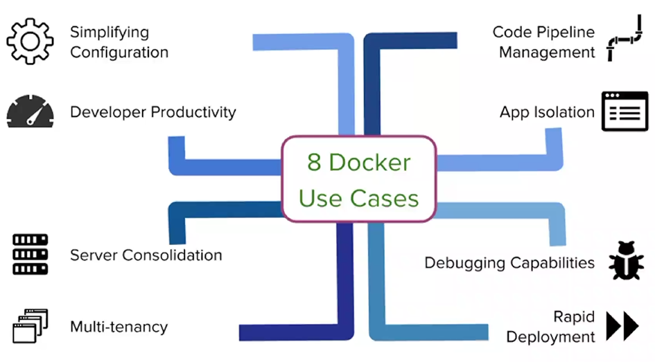

## Docker Architecture

- 
- Docker registry : multiple instances running at the same time
- Docker daemon : Actual instance of the docker it runs
- 
- 
- 
- 
- 
- 
- 
- `https://learn.microsoft.com/en-us/azure/storage/files/files-nfs-protocol`

## Docker commands

- 

- why docker is not inetgrated with azure devops?
- Ans: Reason for not integrating docker into azuredevops :
  azuredevops organization need to maintain the configuration [ Yaml etc ] , they need to update the version of docker regularly for compatibility reasons and they need to manage there own resource like AKS , Azure Container Registry which is quite difficult to.
- 
- 

## 8 docker use cases

- 
- tenancy -> the same software and infrastructure is used by many customers
- 
- 
- 
- 

## Capstone

- `https://azuremarketplace.microsoft.com/en-us/marketplace/consulting-services/capstone-consulting.capstone_windows_assessment`
- `https://azure.microsoft.com/en-us/products/devops`

## GitRepo volume

- 
