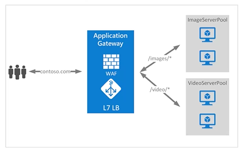

## Logic Apps

- 

## Gateway

- 

## ubuntu commands

1. `kubeadm version`
2. `kubectl config current-context`
3. `kubectl get pods`
4. `kubectl get pods -n argocdns` -> using namespace get pods
5. `kubectl get nodes` -> master node / control plane
6. `kubectl get namespaces`
7. `kubeadm token create --print-join-command` -> for worker node
8. `kubectl create ns demoubuntu` -> namespace creation
9. `kubectl apply -f https://k8s.io/examples/controllers/nginx-deployment.yaml -n demoubuntu` -> deployment yaml
10. `kubectl delete ns namespace` -> delete namespace
11. `kubectl descirbe namespace default` -> describes default namespace
12. `kubectl top pod --namespace=demoubuntu`

## Docker

- Docker is required on all the instances of Kubernetes. Following are the steps to install the Docker.

13. `sudo apt-get update` -> to ensure docker desktop enviorment is updated
14. `sudo apt-get install apt-transport-https ca-certificates` -> adding the certificates to the enviornment where docker will run
15. `sudo apt-key adv \ --keyserver hkp://ha.pool.sks-keyservers.net:80 \ --recv-keys 58118E89F3A912897C070ADBF76221572C52609D` -> gpg key
16. `echo "deb https://apt.dockerproject.org/repo ubuntu-trusty main" | sudo tee /etc/apt/sources.list.d/docker.list`
17. `sudo apt-get install docker-engine` -> installs docker engine in the environment
18. `sudo docker run hello-world` -> ensures your installation appears to be working correctly.
19. `curl -L https://github.com/coreos/etcd/releases/download/v2.0.0/etcd-v2.0.0-linux-amd64.tar.gz -o etcd-v2.0.0-linux-amd64.tar.gz` -> fetch etcd(step -1 -> we download etcd)
20. `tar xzvf etcd-v2.0.0-linux-amd64.tar.gz` -> untar the package
21. `cd etcd-v2.0.0-linux-amd64`
22. `mkdir /opt/bin`
23. `cp etcd* /opt/bin`

## git clone

- step-1: `git clone https://github.com/GoogleCloudPlatform/kubernetes.git`
- step 2: `cd kubernetes`
- step 3: `make release`
- The below command will copy all the configuration files to the required location. Now we will come back to the same directory where we have built the Kubernetes folder. and copy the remaining files
- `cp <Current dir. location>/kube-apiserver /opt/bin/` -> copies api
- `cp <Current dir. location>/kube-controller-manager /opt/bin/`
- `cp <Current dir. location>/kube-kube-scheduler /opt/bin/`
- `cp <Current dir. location>/kubecfg /opt/bin/`
- `cp <Current dir. location>/kubectl /opt/bin/`
- `cp <Current dir. location>/kubernetes /opt/bin/`
- `cp kubernetes/cluster/ubuntu/init_conf/kube-apiserver.conf /etc/init/`
- `cp kubernetes/cluster/ubuntu/init_conf/kube-controller-manager.conf /etc/init/`
- `cp kubernetes/cluster/ubuntu/init_conf/kube-kube-scheduler.conf /etc/init/`
- `cp kubernetes/cluster/ubuntu/initd_scripts/kube-apiserver /etc/init.d/`
- `cp kubernetes/cluster/ubuntu/initd_scripts/kube-controller-manager /etc/init.d/`
- `cp kubernetes/cluster/ubuntu/initd_scripts/kube-kube-scheduler /etc/init.d/`
- `cp kubernetes/cluster/ubuntu/default_scripts/kubelet /etc/default/`
- `cp kubernetes/cluster/ubuntu/default_scripts/kube-proxy /etc/default/`
- `cp kubernetes/cluster/ubuntu/default_scripts/kubelet /etc/default/`
- `ETCD_OPTS = "-listen-client-urls = http://kube-master:4001"`
- `KUBE_APISERVER_OPTS="--address = 0.0.0.0 \--port = 8080 \--etcd_servers = <The path that is configured in ETCD_OPTS> \--portal_net = 11.1.1.0/24 \--allow_privileged = false \--kubelet_port = 9076 \--v = 0"`

## XML Vs YAML Vs Json

- 
- yaml -> key , value pairs
- xml -> tags

## Access control lists

- access and control -> to resources and sevices
- lists -> contains the details that who can access what (contributor , manager , sr. manager)

## Disk encryption sets

- purpose: to apply encryption at the organization level

## role definition

- 

## docker engine vs docker desktop

- 

## docker area, mounts-bind

- 

## kubernetes - requests & limits

- 

## Argo CD

- 
- 
- 
- bitnami -> opensource on cloud (a specific repository)
- bitnami is the option to deploy the services over the cloud in k8 cluster

## reddis vs cosmosdb

- 
- This is the difference over centrlized repo and chargable features between cosmos db and redis cache
- if cache is the thing to be considered -> use reddis
- if cost is the thing to be considered -> use cosmosdb
