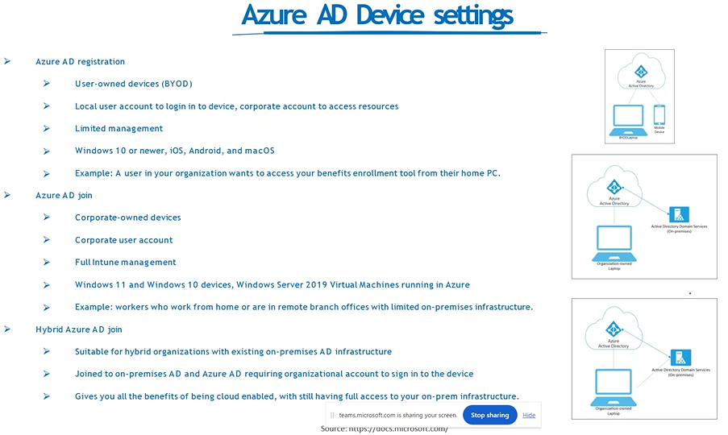
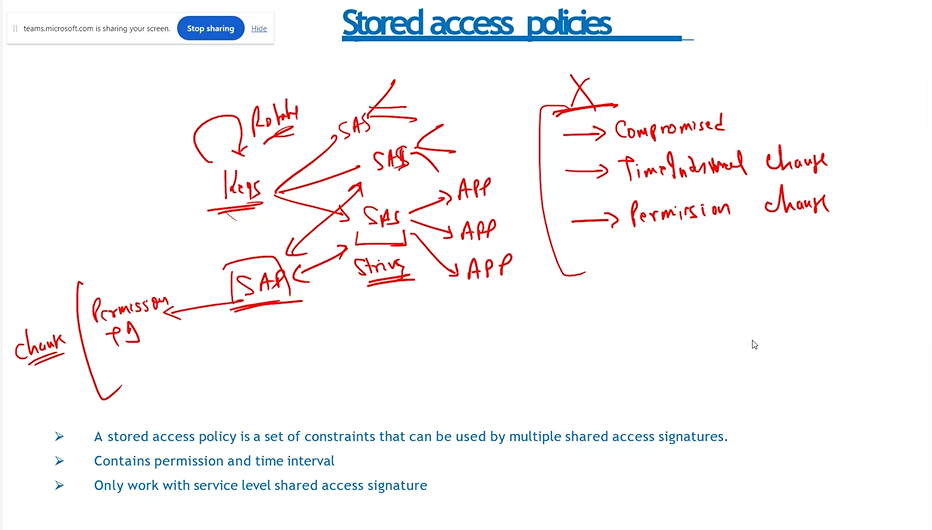
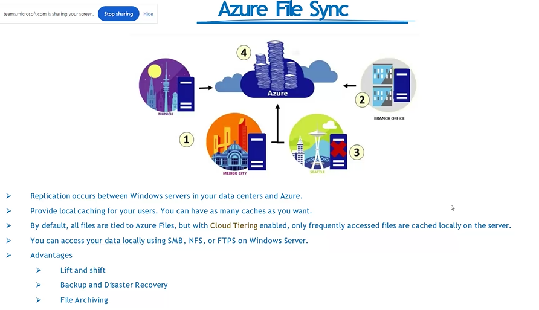
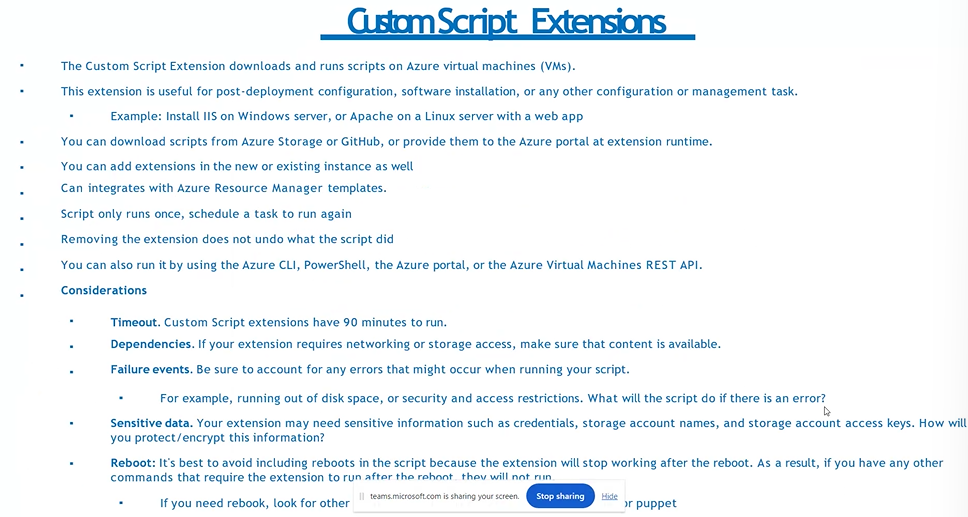

## Why Cloud Computing ?

- Renting PC
- 
- 
- 
- 
- 

> Benefits of cloud computing

- New startUp
- 

> Computing Models

- categories of cloud services -> Saas , Paas , Iaas
- 
- Software as a service -> netflix , amazon etc (everything is ready)
- Platform as a service ->
- Infrastucture as a service -> entire code, software everything is in our hands
- 
- bus,taxi/uber -> Saas
- Rental car -> Paas
- your own car -> Iaas
- 
- 

> deployment models

- types -> private ,public ,hybrid
- 
- 

> cloud pricing models

- 
- 
- 
- 
- 
- 

> Azure Global Infrastructure

- 
- 

> Resorce Groups

- 
- 

> ARM (Azure Resource Manager)

- 

> Subscriptions

- 

> Management Groups

- 

> Azure Active Directory -> cloud based identity and access management service

- 
- 
- 
- 
- 
- 
- 
- 
- 
- 
- 
- 

> Azure RBAC

- 
- 
- 

> Azure Tags

- 

> Azure policy

- 

> cost management

- 

> Azure storage Service

- 

> Azure storage & Data Redundancy

- 
- 
- 
- 
- 
- 
- Archive access tier -> used once in a year
- Cool access tier -> once in a month
- Hot access tier -> very frequently used
- 

> Azure Table storage

- 
- 
- 
- 
- 
- 
- 
- 
- 
- 
- 
- 
- 
- 
- 
- 
- 
- 
- 
- 
- 
- 
- 
- 
- 
- 
- 
- 
- 
- 

> Availability Sets

- 
- 

> Virtual Machines Scale sets

- 

> ARM

- 
- 

> Azure App Service
