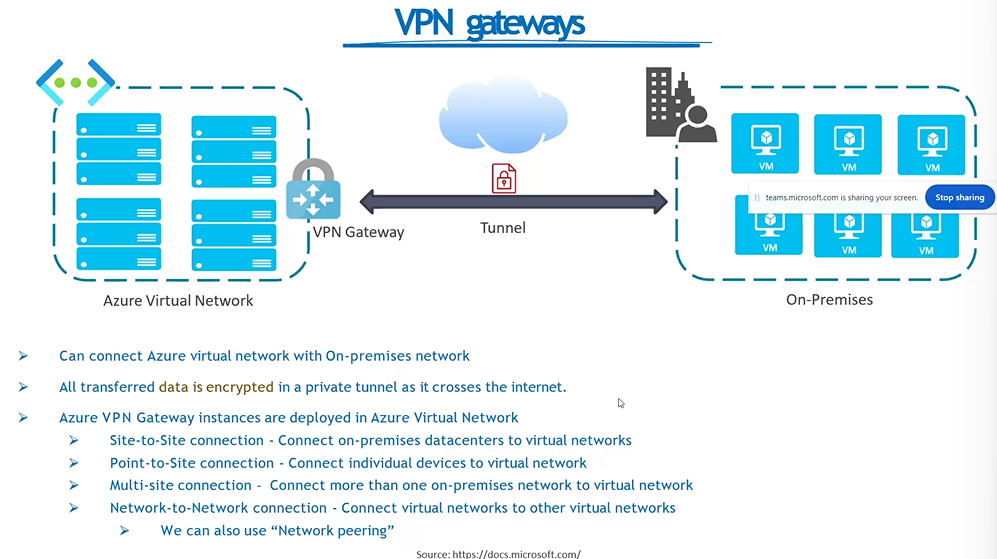

> Azure App Service

- enables you to build and host web apps, background jobs, mobile back-ends , and RESTful API's
- 
- 

> Containers

- wrap up an application into its own isolated package
- 

> ACI VS AKS

- 
- 
- 

> virtual machines vs Containers

- 

> Azure container history

- 

> Docker

- 
- 
- 
- 

> Kubernetes

- 
- 
- 
- 
- 

> storage in AKS

- 
- 

> public vs Private IP address

- 
- 
- 
- 
- 
- 
- 

> Network Interface Card/Controller (NIC)

- 

> user defined network routes

- 

> VNET Peering

- 

> VPN Gateways

- 
- 

> DNS

- 
- 
- 
- 

> Load Balancer

- 
- 
- 

> Application Gateway

- 
- 
