## cloud computing

- pay as you go
- 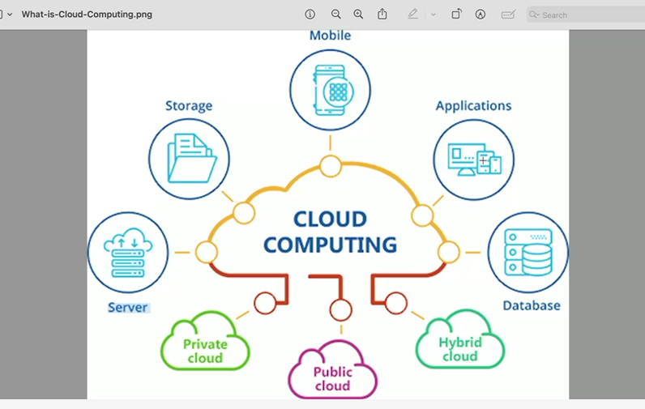
- Applications : web applications , netflix etc
- cloud : private , public(AWS) , hybrid
- PASSWORDS ARE STORED IN cloud with some encryption and decryption techniques
- 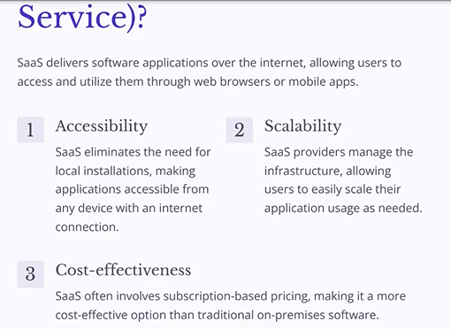
- What is Saas -> Accessibility , scalability , cost- effectiveness
- scalability -> use as you go
- Auto scaling group (ASG)
- AD -> Active Directory
- 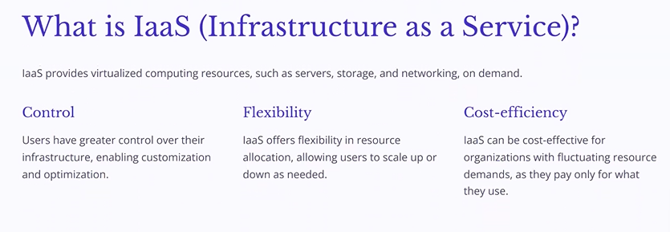
- Saas -> 100% serivce provider
- Iaas -> 100% you manage
- Paas -> 50% you manage and 50% service provider manage
- 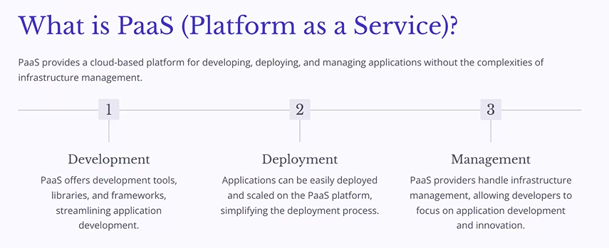
- 3 stages:
  1. development
  2. Testing -> SIT,UAT , NIT
  3. Deployment -> Management CI/CD
- 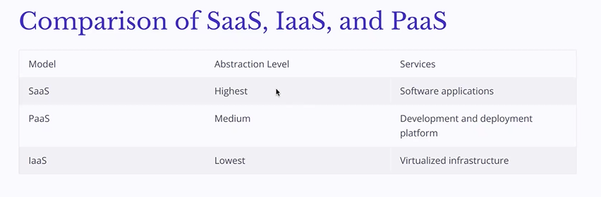
- 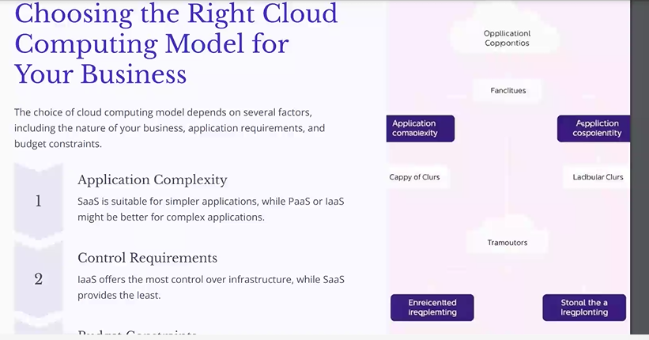
- 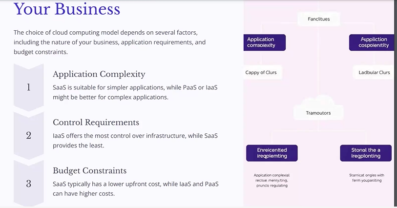
- No.of users , storage , turn around time -> decides the complexity of an application
- Things to decide the type of cloud / service(IAAS,PAAS,SAAS):
  1. Serverless
  2. Deployment
  3. Application
  4. Behaviour
  5. Infrastructure
- 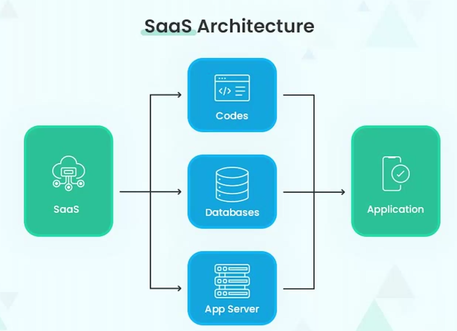

## AZURE

- 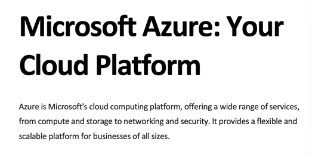
- 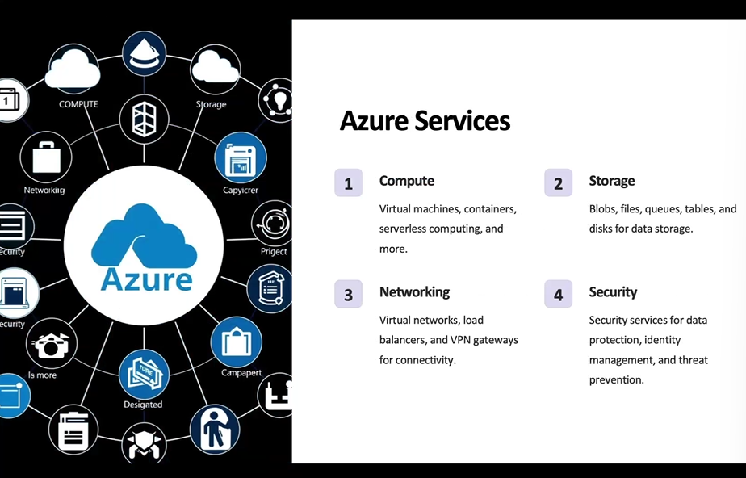
- cloud -> serverless
- 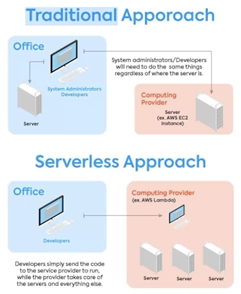
- 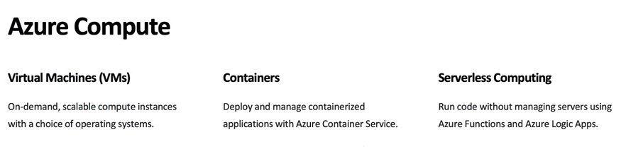
- 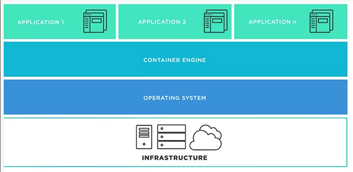
- 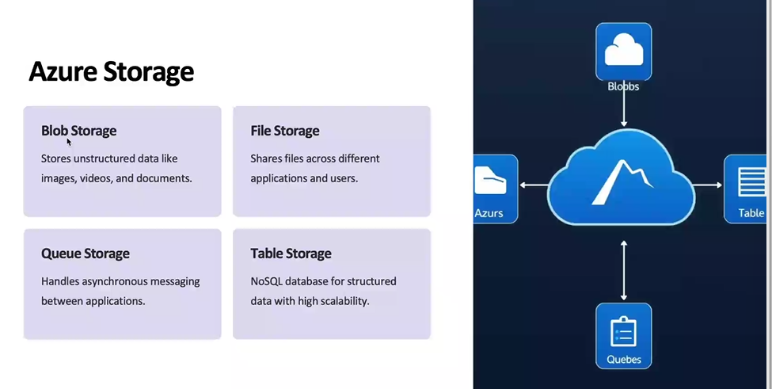
- 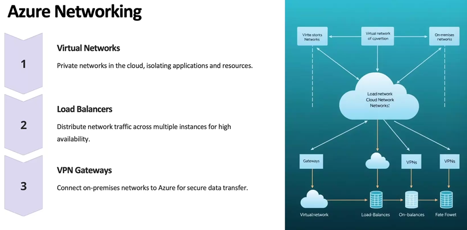
- 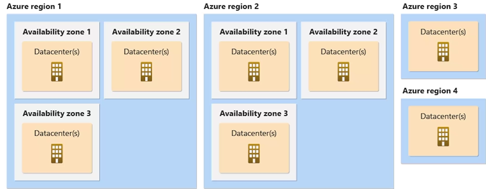
