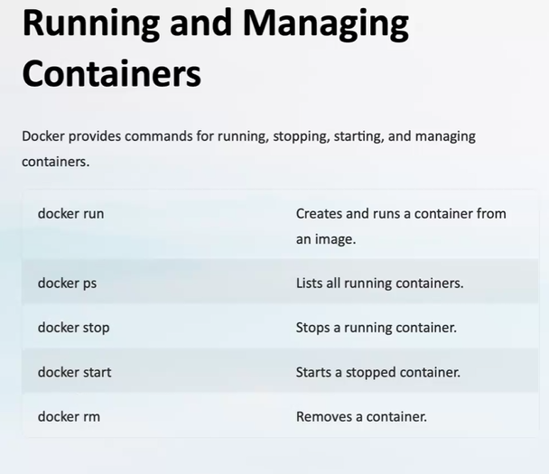

## Azure security

- 
- identity management -> a person should be logged in to azure to use the services.(Authentication and authorization)

## Azure Monitoring

- 

## Azure WebJob

- 
- 
- 
- 
- 
- 
- `https://www.c-sharpcorner.com/article/how-to-create-webjob-in-azure-web-app/`

## Container

- 
- 

## Docker

- 
- 
- 
- 
- 
- 
- 

- `webapp-sql.json` -> Azure resource manager file

## CI/CD

- `https://olohmann.github.io/azure-hands-on-labs/labs/06_cicd_azure_devops/cicd_azure_devops.html`
